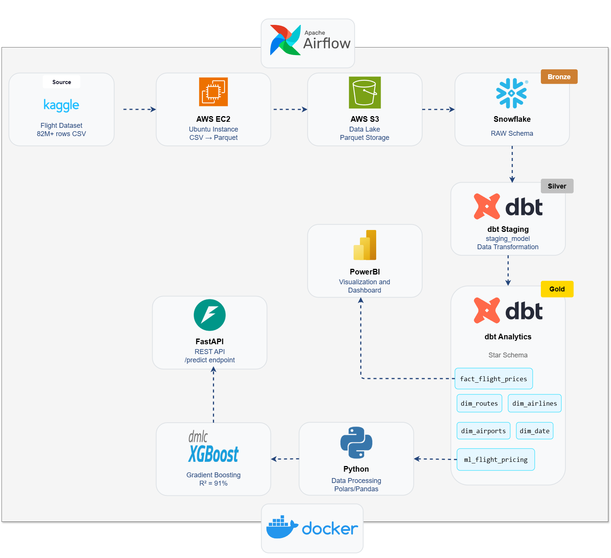
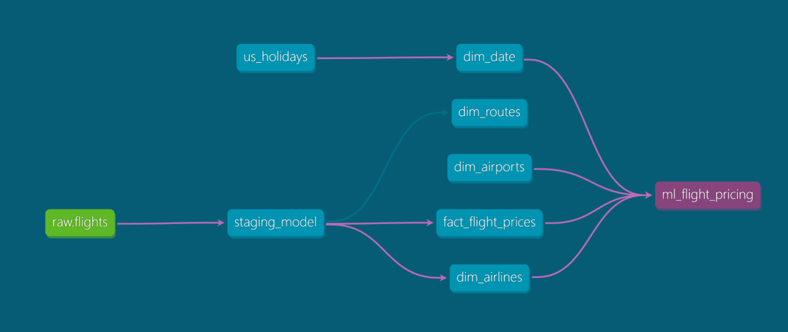

# Dynamic Flight Pricing Pipeline

An end-to-end **Data Engineering** and **Machine Learning** solution for airline price prediction, built on the Modern Data Stack.


---

## Table of Contents

- [Overview](#overview)
- [Architecture](#architecture)
- [Tech Stack](#tech-stack)
- [Project Structure](#project-structure)
- [Data Pipeline](#data-pipeline)
- [Quick Start](#quick-start)
- [Airflow Orchestration](#airflow-orchestration)
- [Model Performance](#model-performance)

---

## Overview

This project demonstrates a production-grade data pipeline that:

1. **Ingests** flight pricing data into Snowflake (Bronze layer)
2. **Transforms** data using dbt with Medallion architecture (Silver → Gold)
3. **Trains** an XGBoost model for price prediction
4. **Serves** predictions via FastAPI with dynamic pricing logic
5. **Orchestrates** the entire pipeline with Apache Airflow

---

## Architecture



---

## Data Warehouse Design


### Star Schema


---

## Tech Stack

| Layer | Technology | Purpose |
|-------|------------|---------|
| **Data Warehouse** | Snowflake | Cloud storage & compute |
| **Ingestion** | Python | Data generation & loading |
| **Transformation** | dbt | SQL-based modeling (Medallion) |
| **Orchestration** | Apache Airflow | Pipeline scheduling & monitoring |
| **ML Framework** | XGBoost | Price prediction model |
| **API** | FastAPI | Real-time inference |
| **Containerization** | Docker | Reproducible environments |

---

## Project Structure

```
Dynamic pricing pipeline/
│
├── airflow/                    # Airflow orchestration
├── api/                        # FastAPI prediction service
├── config/                     # Configuration
├── dbt/                        # dbt transformations
├── docs/                       # Documentation
├── notebooks/                  # Jupyter notebooks│
├── pipeline/                   # Data ingestion
├── docker-compose.yml          # API + Pipeline services
├── docker-compose.airflow.yml  # Airflow services
│
└── README.md
```

---

## Data Pipeline

### Data Flow

```
┌─────────────┐     ┌─────────────┐     ┌─────────────┐     ┌─────────────┐
│   Source    │     │   Bronze    │     │   Silver    │     │    Gold     │
│   (Python)  │ ──> │    (RAW)    │ ──> │  (STAGING)  │ ──> │ (ANALYTICS) │
└─────────────┘     └─────────────┘     └─────────────┘     └─────────────┘
       │                   │                   │                   │
   Generate           Raw flight          Cleaned &           Star Schema
   random data        records             validated           (dims + fact)
                                                                   │
                                                                   ▼
                                                          ┌─────────────┐
                                                          │  ML Table   │
                                                          │  (82M rows) │
                                                          └─────────────┘
                                                                   │
                                                                   ▼
                                                          ┌─────────────┐
                                                          │   FastAPI   │
                                                          │ Predictions │
                                                          └─────────────┘
```

### Medallion Architecture

| Layer | Schema | Description |
|-------|--------|-------------|
| **Bronze** | `RAW` | Raw flight data as-is |
| **Silver** | `STAGING` | Cleaned, typed, validated |
| **Gold** | `ANALYTICS` | Star schema for analysis |

### dbt Models

| Model | Type | Description |
|-------|------|-------------|
| `staging_model` | Incremental | Cleaned flight data |
| `dim_date` | Table | Date dimension (2022-2027) |
| `dim_airlines` | Table | Airline reference |
| `dim_routes` | Table | Route combinations |
| `fact_flight_prices` | Table | Fact table with metrics |
| `ml_flight_pricing` | Table | ML feature table (82M+ rows) |

### Data Lineage



---

## Data Models and Analytics

### Silver Layer (STAGING)

#### staging_model
Cleaned and validated flight data with derived fields:

| Column | Type | Description |
|--------|------|-------------|
| `leg_id` | VARCHAR | Primary key |
| `search_date` | DATE | Parsed search date |
| `flight_date` | DATE | Parsed flight date |
| `starting_airport` | VARCHAR | Normalized origin code |
| `destination_airport` | VARCHAR | Normalized destination code |
| `is_basic_economy` | BOOLEAN | Basic economy flag |
| `is_refundable` | BOOLEAN | Refundable flag |
| `is_non_stop` | BOOLEAN | Direct flight flag |
| `base_fare` | DECIMAL | Base price |
| `total_fare` | DECIMAL | Total price |
| `seats_remaining` | INTEGER | Available seats |
| `total_travel_distance` | DECIMAL | Distance in miles |
| `elapsed_days` | INTEGER | Multi-day flight indicator |
| `travel_duration_minutes` | INTEGER | Parsed duration in minutes |
| `segments_departure_epoch` | VARCHAR | Departure times (epoch) |
| `segments_departure_raw` | VARCHAR | Departure times (raw) |
| `segments_arrival_epoch` | VARCHAR | Arrival times (epoch) |
| `segments_arrival_raw` | VARCHAR | Arrival times (raw) |
| `segments_arrival_airports` | VARCHAR | Arrival airports per segment |
| `segments_departure_airports` | VARCHAR | Departure airports per segment |
| `segments_airline_names` | VARCHAR | Airline names per segment |
| `segments_airline_codes` | VARCHAR | Airline codes per segment |
| `segments_equipment` | VARCHAR | Aircraft types |
| `segments_duration_seconds` | VARCHAR | Duration per segment |
| `segments_distances` | VARCHAR | Distance per segment |
| `segments_cabin_codes` | VARCHAR | Cabin codes per segment |
| `fare_basis_code` | VARCHAR | Fare class code |
| `loaded_at` | TIMESTAMP | Transformation timestamp |
| `days_until_flight` | INTEGER | Booking lead time (derived) |
| `num_segments` | INTEGER | Number of flight segments (derived) |
| `first_departure_epoch` | VARCHAR | First segment departure (derived) |
| `last_arrival_epoch` | VARCHAR | Last segment arrival (derived) |
| `primary_carrier` | VARCHAR | Main airline code (derived) |
| `primary_cabin` | VARCHAR | Main cabin class (derived) |
| `taxes_and_fees` | DECIMAL | Tax amount (derived) |

---

### Gold Layer (ANALYTICS)

#### dim_date (Date Dimension)
| Column | Type | Description |
|--------|------|-------------|
| `date_key` | INTEGER | Primary key (YYYYMMDD format) |
| `date_day` | DATE | Full date |
| `year` | INTEGER | Year |
| `month` | INTEGER | Month number |
| `month_name` | VARCHAR | Month name (January, February, etc.) |
| `day_of_week_num` | INTEGER | Weekday number (0-6) |
| `day_name` | VARCHAR | Weekday name (Mon, Tue, etc.) |
| `quarter` | INTEGER | Quarter (1-4) |
| `quarter_name` | VARCHAR | Quarter label (Q1 2025) |
| `is_weekend` | BOOLEAN | Weekend indicator |
| `holiday_name` | VARCHAR | Holiday name (if applicable) |
| `is_holiday` | BOOLEAN | US holiday indicator |

#### dim_airlines (Airline Dimension)
| Column | Type | Description |
|--------|------|-------------|
| `airline_code` | VARCHAR | Primary key (AA, UA, DL, etc.) |
| `airline_name` | VARCHAR | Full airline name |
| `created_at` | TIMESTAMP | Record creation time |

#### dim_routes (Route Dimension)
| Column | Type | Description |
|--------|------|-------------|
| `route_key` | VARCHAR | Primary key (origin_dest format) |
| `origin_airport` | VARCHAR | Departure airport code |
| `dest_airport` | VARCHAR | Arrival airport code |
| `distance_miles` | INTEGER | Average route distance |
| `created_at` | TIMESTAMP | Record creation time |

#### dim_airports (Seed)
| Column | Type | Description |
|--------|------|-------------|
| `code` | VARCHAR | Airport IATA code (PK) |
| `name` | VARCHAR | Full airport name |
| `city` | VARCHAR | City location |
| `state` | VARCHAR | State/region |

#### fact_flight_prices (Fact Table)
Central fact table containing all flight pricing transactions. Joins dimension tables via foreign keys (`route_key`, `date_key`, `airline_key`, `origin_airport_key`, `dest_airport_key`) to enable multi-dimensional analysis. Contains pricing metrics (fares, taxes, fare_per_mile), inventory data (seats_remaining), booking context (days_until_flight), and flight characteristics (duration, segments, cabin class, refund policy).

#### ml_flight_pricing (ML Feature Table)
Denormalized, ML-ready table with 82M+ rows. Flattens the star schema into a single wide table optimized for model training. Includes the target variable (`total_fare`), numeric features (distance, duration, days_until_flight, seats_remaining), categorical features (airline, origin/destination cities), and temporal features (year, month, day_of_week, is_weekend, is_holiday). Boolean flags converted to integers (0/1) for ML compatibility.

---

## Quick Start

### Prerequisites

- Python 3.11+
- Docker & Docker Compose
- Snowflake account
- dbt CLI

### 1. Clone & Setup Environment

```bash
git clone https://github.com/Yousefuwk20/dynamic-flight-pricing.git
cd "Dynamic pricing pipeline"

# Create .env file in config/
cp pipeline/.env.template config/.env
# Edit config/.env with Snowflake credentials
```

### 2. Setup Snowflake

```sql
CREATE DATABASE FLIGHT_PRICING;
CREATE WAREHOUSE FLIGHT_WH WITH WAREHOUSE_SIZE = 'XSMALL';
CREATE SCHEMA RAW;
CREATE SCHEMA STAGING;
CREATE SCHEMA ANALYTICS;
```

### 3. Run Ingestion (Local)

```bash
cd pipeline
pip install -r requirements.txt

# Generate and load 1000 flight records
python ingest.py --records 1000
```

### 4. Run dbt Transformations

```bash
cd dbt
pip install dbt-snowflake

# Install dependencies & run
dbt deps
dbt seed      # Load airports, holidays
dbt run       # Transform data
dbt test      # Run data quality tests
```

### 5. Start API

```bash
cd api
pip install -r requirements.txt
uvicorn app:app --reload --host 0.0.0.0 --port 8000
```

API available at: http://localhost:8000

---

## Airflow Orchestration

### Start Airflow

```bash
# Build and start Airflow
docker-compose -f docker-compose.airflow.yml up -d

# Access Airflow UI
# URL: http://localhost:8080
# Username: admin
# Password: admin
```

### DAG: `flight_pricing_pipeline`

Runs daily at midnight:

```
ingest_flight_data → dbt_run → dbt_test
```

| Task | Description |
|------|-------------|
| `ingest_flight_data` | Generate 1000 records → Snowflake RAW |
| `dbt_run` | Run all dbt models |
| `dbt_test` | Execute data quality tests |

### Stop Airflow

```bash
docker-compose -f docker-compose.airflow.yml down
```

---

## Model Performance

| Metric | Value |
|--------|-------|
| **R² Score** | 91% |
| **RMSE** | $51.93 |
| **MAE** | $33.97 |
| **Training Data** | 23M+ rows |

---


